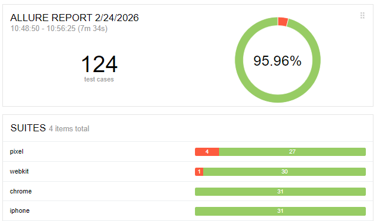

# Folk Mart Playwright Testing

Playwright-based test project for the Folk Mart web application.

Application URL: `https://folk-mart-1.onrender.com`

## Table of Contents
- [Project Overview](#project-overview)
- [Latest Execution Snapshot (February 24, 2026)](#latest-execution-snapshot-february-24-2026)
- [Allure Summary Image](#allure-summary-image)
- [Coverage Inventory](#coverage-inventory)
- [Project Structure](#project-structure)
- [Tag Model](#tag-model)
- [Browser and Device Matrix](#browser-and-device-matrix)
- [Installation](#installation)
- [Environment Configuration](#environment-configuration)
- [Run Commands](#run-commands)
- [Reports](#reports)
- [CI Execution (Manual Only)](#ci-execution-manual-only)
- [Failure Semantics](#failure-semantics)
- [Flakiness Controls](#flakiness-controls)
- [Test Strategy (One Page)](#test-strategy-one-page)

## Project Overview

- Test layers: `E2E`, `API`, `Integration`, `Security smoke`, `A11y`
- Design approach: `POM + Flow` layers with centralized test data
- Execution style: tag-based selection, browser matrix, shard-ready commands

## Latest Execution Snapshot (February 24, 2026)

### Full suite
- Command: `npm test`
- Result: `124 total`, `95 passed`, `29 failed`, `0 skipped`

### Detected Bugs From This Run (29 Failed Cases)

| Project | Test case | Observed failure | Detected bug | Recommended fix |
|---|---|---|---|---|
| `webkit` (14 fails) | `A11Y-P02`, `A11Y-P03`, `A11Y-P04`, `AUTHE2E-P01`, `AUTHE2E-E01`, `CHECKOUTE2E-P01/N01/E01` (authorization), `CHECKOUTE2E-P01/N01/E01` (purchase), `ORDERSINT-P01/N01/E01` | Login/session-dependent flows fail in sequence; protected pages and downstream checkout/order flows become unreachable or unstable after auth step | `FM-BUG-004` session persistence or auth-state propagation instability on WebKit matrix | Validate cookie/session persistence (Set-Cookie flags, SameSite, secure, domain/path), add deterministic post-login session check endpoint, and harden auth guard handling before dependent navigation |
| `iphone` (14 fails) | `A11Y-P02`, `A11Y-P03`, `A11Y-P04`, `AUTHE2E-P01`, `AUTHE2E-E01`, `CHECKOUTE2E-P01/N01/E01` (authorization), `CHECKOUTE2E-P01/N01/E01` (purchase), `ORDERSINT-P01/N01/E01` | Same failure pattern as WebKit desktop across auth-dependent and order-dependent journeys | `FM-BUG-005` mobile WebKit auth/session continuity defect (same family as FM-BUG-004) | Fix auth/session continuity for mobile WebKit, then re-verify full flow chain (`auth -> cart -> checkout -> orders`) with project-specific diagnostics enabled |
| `pixel` (1 fail) | `CHECKOUTE2E-E01` (`tests/e2e/checkout/purchase.e2e.spec.ts:35`) | Invalid-expiry validation path fails only on Pixel during checkout edge flow | `FM-BUG-006` checkout form readiness/state transition race on Pixel | Add explicit readiness checks before billing/payment fill, verify checkout step transition completion, and stabilize edge validation assertion timing |


## Allure Summary Image



## Coverage Inventory

Active specs:

- `tests/a11y/critical/pages.a11y.spec.ts`
- `tests/api/auth/auth-catalog.api.spec.ts`
- `tests/e2e/auth/reset-password.e2e.spec.ts`
- `tests/e2e/auth/login.e2e.spec.ts`
- `tests/e2e/checkout/authorization.e2e.spec.ts`
- `tests/e2e/checkout/purchase.e2e.spec.ts`
- `tests/integration/orders/api-to-ui.integration.spec.ts`
- `tests/security/api/smoke.security.spec.ts`

Out of active suite:

- `tests/e2e/checkout/quantity-over-stock.e2e.spec.ts`

## Project Structure

```text
src/
  api/            # API client wrapper
  config/         # Environment parsing
  data/           # Test data and constants
  fixtures/       # Shared fixtures
  flows/          # Business flows
  pages/          # Page objects (POM)
  support/        # Utilities (a11y, state control, test ids)
tests/
  a11y/
  api/
  e2e/
  integration/
  security/
```

## Tag Model

### Test Type
- `@e2e`
- `@api`
- `@integration`
- `@a11y`
- `@security`

### Execution Scope
- `@smoke`
- `@regression`
- `@critical`

### Data or State Impact
- `@safe`
- `@destructive`
- `@seeded`

### Business Area
- `@auth`
- `@catalog`
- `@cart`
- `@checkout`
- `@orders`

Example:
`Customer completes purchase flow @e2e @critical @destructive @checkout @orders`

## Browser and Device Matrix

- `chrome` (`Desktop Chrome`, channel `chrome`)
- `webkit` (`Desktop Safari/WebKit`)
- `iphone` (`iPhone 14`)
- `pixel` (`Pixel 7`)

## Installation

```bash
npm ci
npx playwright install --with-deps chrome webkit
```

## Environment Configuration

Copy `.env.example` to `.env`.

Required keys:

- `APP_BASE_URL`
- `API_BASE_URL`
- `TEST_API_KEY`
- `ALLOW_TEST_CONTROL_API`
- `STOCK_RESET_VALUE`
- `TEST_USER_USERNAME`
- `TEST_USER_PASSWORD`
- `TEST_USER_EMAIL`
- `TEST_COUPON_CODE`

Recommended profiles:

1. `prod-safe`
- `ALLOW_TEST_CONTROL_API=false`

2. `seeded-control`
- `ALLOW_TEST_CONTROL_API=true`
- `STOCK_RESET_VALUE=50`
- Backend prerequisites for stock control in production:
  - `TEST_MODE=true`
  - `TEST_ALLOW_PROD_STOCK_CONTROL=true`
  - strong `TEST_API_KEY`

## Run Commands

Run all:

```bash
npm test
```

Run by tag:

```bash
npm run test:smoke
npm run test:regression
npm run test:critical
npm run test:e2e
npm run test:api
npm run test:integration
npm run test:security
npm run test:a11y
```

Run by matrix target:

```bash
npm run test:chrome
npm run test:webkit
npm run test:iphone
npm run test:pixel
```

Run shards:

```bash
npm run test:critical:shard:1of2
npm run test:critical:shard:2of2
```

## Reports

HTML report:

```bash
npm run report:html
```

Allure report:

```bash
npm run report:allure:generate
npm run report:allure:open
```

Main output paths:

- `playwright-report/index.html`
- `allure-report/index.html`
- `docs/images/allure-overall-summary.png`

## CI Execution (Manual Only)

CI workflow runs only via `workflow_dispatch` (manual trigger).

Workflow file:

- `.github/workflows/playwright.yml`

Required GitHub Secrets:

- `TEST_API_KEY`
- `TEST_USER_PASSWORD`

Manual inputs at runtime:

- `app_base_url`
- `api_base_url`
- `allow_test_control_api`
- `test_user_username`
- `test_user_email`
- `test_coupon_code`

## Failure Semantics

- Expected-fail annotations are disabled in this suite.
- Every failed test reported in Playwright/Allure is a true fail and should be treated as a real defect until triaged.
- Bug IDs in the execution table are reporting labels only and do not change pass/fail behavior.

## Flakiness Controls

- Locator + `expect` patterns only (`waitForTimeout` avoided)
- `data-testid` as primary selector strategy
- Retries: `CI=1`, local `=0`
- Trace, screenshot, and video enabled
- Parallel and shard-compatible test commands
- Optional stock reset via `/api/test/reset-stock` when control API is enabled

## Test Strategy (One Page)

In scope:

- Critical business flows: `auth`, `catalog`, `cart`, `checkout`, `orders`
- Cross-layer coverage: `E2E`, `API`, `Integration`, `Security smoke`, `A11y`

Out of scope:

- Full visual regression suite
- Full DAST or penetration testing
- Long-tail non-critical permutations

Primary risks:

- Authentication or session instability
- Incorrect totals or checkout logic
- Missing authorization checks on protected APIs
- Regressions in password reset and invoice workflows

Coverage mapping:

- `E2E`: user-centric flows through UI
- `API`: direct endpoint validation and auth behavior
- `Integration`: cross-layer state validation (API to UI)
- `Security smoke`: CORS, auth guard, baseline headers/cookies
- `A11y`: critical user journeys only
